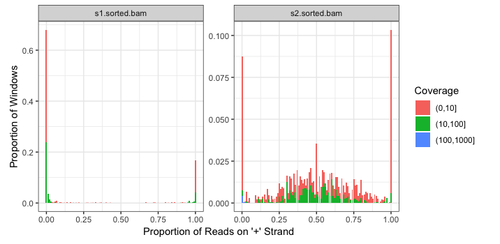
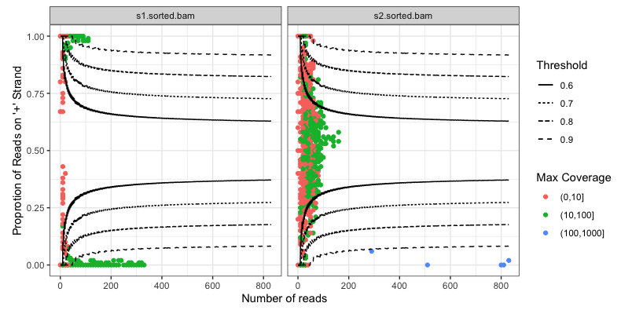
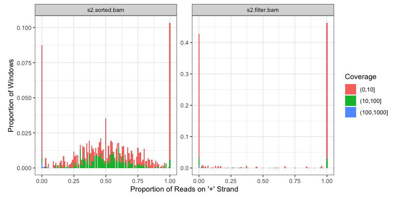

# Summary

RNA-seq data reveals the expression level of every gene/transcript extracted from a specific tissue of an individual. 
Numerous research questions can involve a study of the relationship between gene expression and phenotypes, or treatment groups.
However, assessing data quality is the first step before performing any analysis.
``fastqc`` [@Andrews2014] has become an  industry-standard quality control tool for much high throughput sequencing data.
This package aims to provide an additional quality control step for strand-specific RNA-seq data, to quickly detect issues with library preparation, and also to rescue it in some less extreme cases.

Within the genome, each gene is encoded on either the positive or negative strand, which is used as the template for transcribed, single-stranded RNA.
In high-throughput sequencing technology, cellular RNA molecules are extracted, fragmented then several library preparation steps are performed before being sequenced in a massively parallel reaction, which generates millions of reads. 
A sequencing machine is agnostic to the original strand of the fragments, however, a strand-specific library preparation protocol [@Zhong2011] is able to preserve information about the strand of the original RNA template molecule. 
Hence, in the bam file, which is obtained from mapping reads back to the reference genome, reads deriving from the same RNA molecule should be mapped to the same strand.
In contrast, if contaminating genomic DNA is present, the double stranded nature of these molecules will lead to reads aligning to both strands.
By studying the strand of aligned reads within a suitable window, we can identify the presence of reads which are likely to derive from double stranded DNA fragments. 

In the R package `strandCheckR`, we use a sliding window to scan any bam files under review. 
This will return a data frame giving the coordinates of each window and the number of reads aligning to the $+$/$-$ strands within it. 
Using this data frame, users can plot a histogram of strand proportions which can enable identification of the levels of DNA contamination. 
In the example shown in Fig.1, the file `s1.sorted.bam` has minimal contaminating DNA, whilst the file `s2.sorted.bam` shows a pattern consistent with contamination.

We also provide a scatter plot with threshold guidelines (Fig.2) which can help to select an appropriate threshold $\tau$ ($0.5 < \tau < 1$) to filter reads which are likely to derive from contaminating DNA.

For the filtering steps, we use logistic regression to estimate the read strand proportion $\pi_W$ and its standard deviation $\sigma_W$ in each window $W$. 
We then use these values to decides if $W$ contains any reads coming from RNA or not.
The null hypothesis for a window containing positively-stranded reads is $H_0: \pi < \tau$, and for negative-stranded windows is $H_0: \pi \ge 1-\tau$.
By default, only windows which reject $H0$ at the level $\alpha = 0.05$ are considered to contain RNA.

For each window $W$, let $p_W$ and $n_W$ be the number of positive and negative reads in $W$.
We then assign for $W$ an initial probability of keeping positive and negative reads, namely $k^{+}_W$ and $k^{-}_W$ using the following procedure. 
If $W$ is determined to not contain any read coming from RNA, then $k^{+}_W=k^{-}_W=0$.
Otherwise, $W$ is assumed to contain some RNA reads and two scenarios are investigated.
If $W$ contains more positive reads than negative ones ($p_W >> n_W$), then $W$ is assumed to contain RNA coming from positive strand, and we remove reads aligned to the negative strand,
(i.e. $k^{-}_W=0$) and the same number of reads aligned to the positive strand.
As these are assumed to each be paired with a read aligned to the negative strand ones (i.e. $k^{+}_W=(p_W-n_W)/p_W$), each positive read is kept with probability $k^{+}_W$.
The mirror of this process is applied if a windows is determined to contain reads primarily from a negatively stranded gene.
However, each read can be belong to several different sliding windows due to overlapping windows can overlap, and due to the nature of spliced alignments. 
Hence, the final probability of each read is the maximum of all windows which contain that read. 
Fig.3 shows the differences in strand proportion before and after filtering DNA of an example file.

``strandCheckR`` is an R package which make uses of several functions from core Bioconductor packages such as ``GenomicAlignments``, ``GenomicRanges``  [@Lawrence2013], and ``Rsamtools`` [@Morgan2018].
The window read count function is designed flexibly so that user can filter low  mapping quality reads, set the minimum proportion required for a read to overlap and be included in a window, define window length & step size etc. 
It has also been implemented in an efficient way to manage large bam files. 
For a human RNA-seq bam file of ~4Gb, it takes less than 3 minutes to scan the whole file and return a Data Frame of about 1.5Gb. 
The package can be installed via Bioconductor repository https://bioconductor.org/packages/strandCheckR and is also available on github http://github.com/UofABioinformaticsHub/strandCheckR.

# References